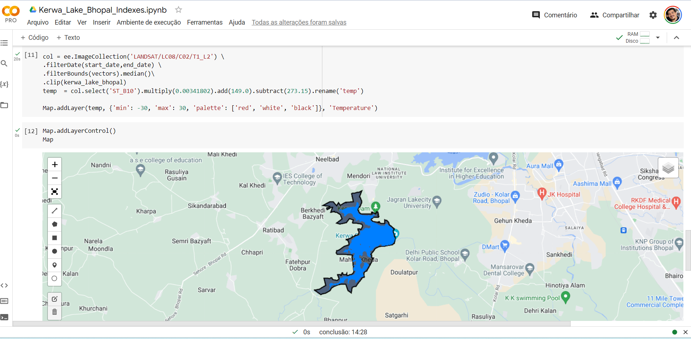
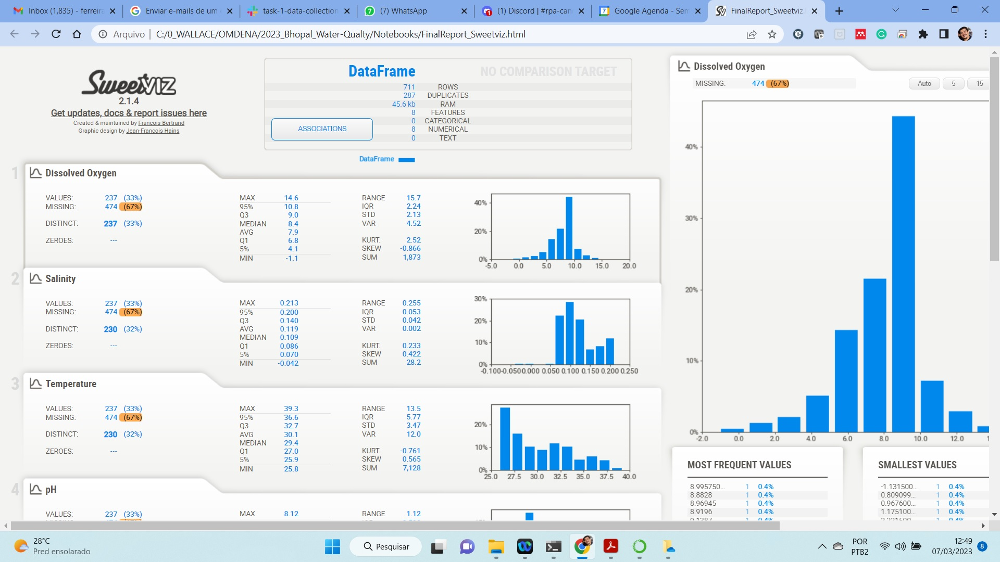
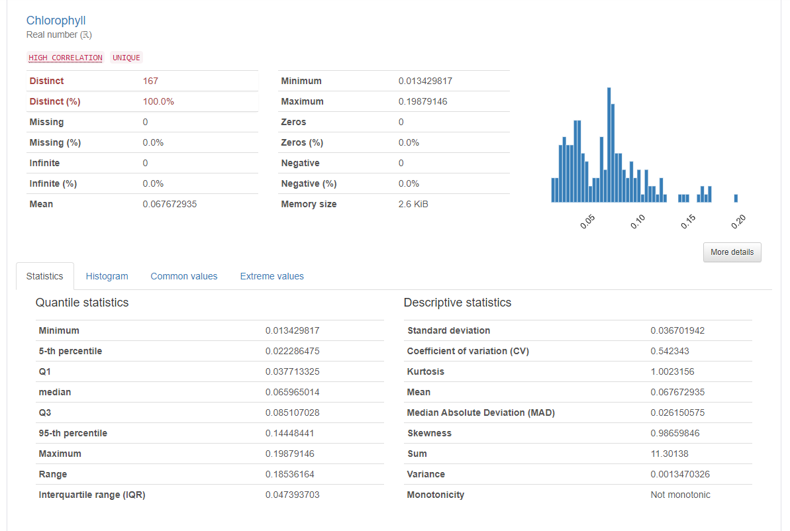
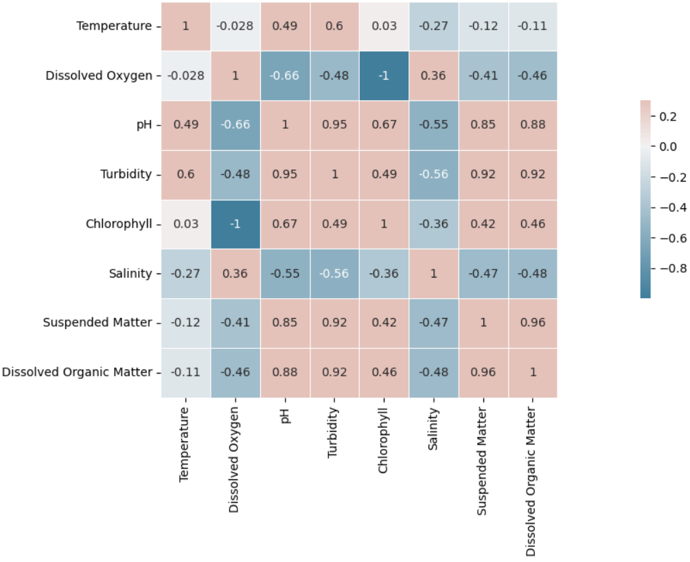
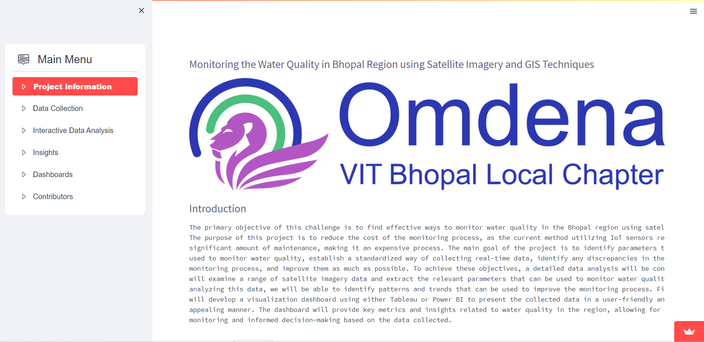

# Monitoring the Water Quality in Bhopal Region using Satellite Imagery and GIS Techniques

This is a collaborative and open sourece project promoted by Omdena VIT Bhopal Chapter

Project detailed description: https://omdena.com/projects/monitoring-the-water-quality-in-bhopal-region/

## Data Collection - Google Earth Engine APIs

The satellite data for different water quality related indexes (pH, temperature, turbidity, etc) was collected by using Google Earth Engine Python APIs

Link to sample code in Colab: https://colab.research.google.com/drive/1WhR9HkJawPfC9JefXdMCLAxBZ5Cg5tFG?usp=sharing

## EDA - Exploratory Data Analysis

## Streamlit Web App Deployed

At the end of the project the team developed a Web App by using Streamlit to showcase project details and results.

Link to the Web App:  https://vaasu2002-omdena-bhopal-water-quality-dashboard-main-pzjmtf.streamlit.app/

## Project GitHub Complete Repo

https://github.com/OmdenaAI/omdena-bhopal-water-quality-monitoring

